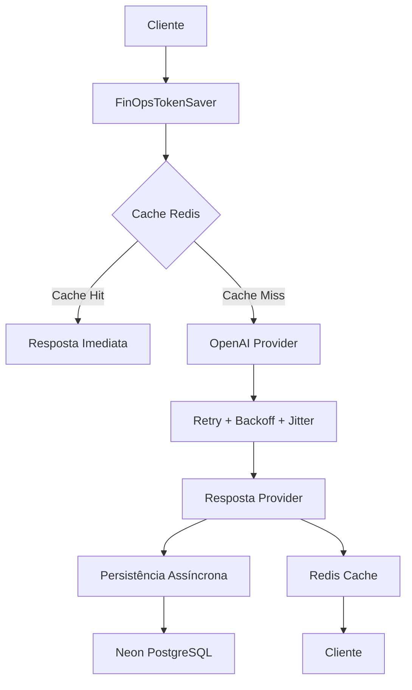

# FinOpsTokenSaver — Análise Arquitetural e Documentação Técnica

## Visão Geral

O projeto `FinOpsTokenSaver` é um AI Gateway / Reverse Proxy especializado em FinOps para LLMs.

A solução foi desenhada para funcionar como uma camada intermediária entre aplicações clientes e provedores de IA como OpenAI, com foco principal em:

- Redução de custos com tokens
- Reutilização inteligente de respostas
- Resiliência contra rate limit
- Observabilidade operacional
- Persistência de métricas financeiras
- Compatibilidade com APIs estilo OpenAI
- Execução em infraestrutura gratuita

A arquitetura do projeto demonstra uma preocupação muito forte com:

- baixo consumo de memória
- desacoplamento
- infraestrutura serverless/free tier
- resiliência distribuída
- testabilidade
- extensibilidade futura

---

# Stack Tecnológica Identificada

## Backend

- Python
- FastAPI
- Async IO
- Uvicorn/Gunicorn (implícito pela arquitetura)

## Banco de Dados

- PostgreSQL
- Neon Serverless Postgres

## Cache

- Redis

## Infraestrutura

- Docker
- Azure App Service F1

## Qualidade

- Pytest
- Ruff

---

# Estrutura do Projeto

## Estrutura Identificada

```text
FinOpsTokenSaver/
 ├── docs/
 ├── migrations/
 ├── scripts/
 ├── src/
 │    └── finops_token_saver/
 ├── tests/
 ├── Dockerfile
 ├── Makefile
 ├── pyproject.toml
 └── README.md
```

---

# Arquitetura Conceitual

O projeto implementa um modelo de AI Gateway orientado a pipeline.

## Fluxo Principal



---

# Características Arquiteturais

## 1. API Gateway Compatível com OpenAI

O endpoint principal:

```http
POST /v1/chat/completions
```

permite compatibilidade quase transparente com SDKs da OpenAI.

Isso significa que aplicações existentes podem migrar apenas alterando:

```text
BASE_URL
```

Sem necessidade de refatorações profundas.

Essa decisão arquitetural é extremamente estratégica.

---

# 2. Estratégia FinOps

O núcleo da solução está na redução de custo operacional de IA.

## Cache Exato

A solução implementa:

- payload canônico
- hashing determinístico
- reaproveitamento de respostas idênticas

### Benefícios

- redução direta de consumo de tokens
- menor latência
- menor uso de provider
- maior throughput

---

# 3. Payload Canônico

Os testes encontrados:

```text
test_canonical_payload.py
```

indicam uma preocupação correta com:

- normalização de payload
- determinismo de hash
- estabilidade de cache key

Isso é extremamente importante.

Sem canonicalização:

```json
{"a":1,"b":2}
```

e

```json
{"b":2,"a":1}
```

poderiam gerar hashes diferentes.

O projeto aparentemente resolve isso corretamente.

---

# 4. Retry Inteligente

Foi identificado:

```text
RetryingProviderClient
```

com:

- exponential backoff
- jitter
- tratamento de HTTP 408
- tratamento de HTTP 429
- tratamento de 5xx

Essa implementação demonstra maturidade arquitetural.

## Benefícios

- evita thundering herd
- reduz cascata de falhas
- aumenta resiliência
- melhora estabilidade do provider

---

# 5. Estratégia Async

A arquitetura foi claramente desenhada para:

- baixo uso de RAM
- não bloqueio
- alta concorrência
- infraestrutura limitada

Isso é coerente com:

```text
Azure App Service F1
```

A decisão por:

- FastAPI
- Async IO
- persistência assíncrona

foi tecnicamente correta.

---

# 6. Persistência Assíncrona

O projeto separa corretamente:

## Caminho Crítico

- resposta ao usuário

## Caminho Secundário

- auditoria
- métricas
- persistência

Isso reduz:

- latência
- contenção
- impacto do banco

Excelente decisão arquitetural.

---

# 7. Métricas FinOps

O sistema registra:

- tokens
- custo estimado
- economia estimada
- latência
- provider
- cache hit/miss

Isso transforma o projeto em:

- gateway
- observability layer
- plataforma FinOps

Não apenas um proxy.

---

# 8. Design Orientado a Providers

O README indica intenção futura de suportar:

- OpenAI
- Anthropic
- Gemini

Isso sugere arquitetura baseada em:

- adapters
- strategy pattern
- provider abstraction

Arquiteturalmente correto.

---

# 9. Estratégia de Infraestrutura Gratuita

Um dos pontos mais inteligentes do projeto.

Toda a arquitetura foi desenhada para respeitar:

## Azure F1

- 1GB RAM
- CPU limitada

## Redis Free Tier

- memória limitada
- TTL agressivo

## Neon Serverless

- auto suspend
- cold start

O sistema foi explicitamente modelado para operar dentro dessas limitações.

Isso demonstra forte pensamento FinOps desde o design.

---

# Testes Identificados

## Testes encontrados

```text
test_openai_provider.py
test_canonical_payload.py
test_postgres_integration.py
test_cache_policy.py
test_chat_completions_auth.py
```

---

# Qualidade Técnica Observada

## Pontos Fortes

### Excelente preocupação arquitetural

O projeto foi pensado antes de ser codificado.

Isso fica extremamente evidente na documentação.

---

### Separação correta de responsabilidades

Existe clara divisão entre:

- provider
- cache
- persistência
- métricas
- retry
- autenticação

---

### Forte orientação a FinOps

O projeto resolve um problema real.

Especialmente para:

- startups
- SaaS com IA
- APIs de IA corporativas
- produtos com alto volume de prompts

---

### Excelente aderência a cloud-native

A arquitetura favorece:

- horizontalização futura
- containers
- serverless
- observabilidade

---

### Forte preocupação com resiliência

Retry + jitter + cache + async persistence mostram maturidade.

---

# Pontos de Evolução Recomendados

## 1. Cache Semântico

Hoje o projeto aparentemente implementa:

- exact cache

Mas o roadmap cita:

- semantic cache

Esse será um divisor de águas.

## Sugestão

Adicionar:

- embeddings
- cosine similarity
- threshold configurável
- semantic deduplication

Possíveis stacks:

- pgvector
- Qdrant
- Redis Vector

---

# 2. Multi Provider Routing

Futuro extremamente promissor.

Exemplo:

- OpenAI fallback
- Gemini fallback
- Anthropic fallback

Com:

- custo dinâmico
- latência dinâmica
- SLA awareness

Isso transformaria o projeto em um verdadeiro:

## AI Traffic Router

---

# 3. Rate Limiting Interno

Recomendado adicionar:

- token bucket
- sliding window
- quotas por API key

---

# 4. Dashboard Operacional

O projeto ganharia muito valor com:

- Grafana
- Prometheus
- dashboard React/Next.js

Métricas:

- economia acumulada
- cache hit ratio
- custo por provider
- custo por cliente
- top prompts
- requests/min

---

# 5. Streaming Support

A documentação menciona cuidado com streaming.

Suporte completo a:

```text
stream=true
```

será importante.

---

# 6. Segurança

## Recomendações

Adicionar:

- API key rotation
- JWT support
- RBAC
- audit trail
- abuse detection
- prompt injection detection

---

# 7. Observabilidade

Adicionar:

- OpenTelemetry
- distributed tracing
- correlation ids
- provider latency histograms

---

# 8. Persistência de Custos Históricos

Hoje o sistema registra métricas.

Mas pode evoluir para:

- billing engine
- tenant billing
- chargeback
- cost center allocation

Muito alinhado com FinOps enterprise.

---

# Potencial Comercial

O projeto possui potencial real para:

- produto SaaS
- middleware corporativo
- plataforma FinOps para IA
- API gateway comercial
- camada multi-provider enterprise

Especialmente considerando o crescimento explosivo de custos com LLMs.

---

# Nível Técnico do Projeto

## Avaliação Geral

### Arquitetura
9/10

### Clareza Conceitual
9/10

### FinOps Thinking
10/10

### Escalabilidade Conceitual
8/10

### Observabilidade
7/10

### Segurança
6.5/10

### Extensibilidade
9/10

### Maturidade Atual do MVP
7.5/10

---

# Conclusão Técnica

O FinOpsTokenSaver demonstra:

- forte capacidade arquitetural
- excelente entendimento de cloud economics
- entendimento correto de resiliência distribuída
- preocupação real com custos operacionais de IA
- pensamento de produto técnico

O projeto está muito acima de um simples proxy de IA.

A base arquitetural já aponta para:

- AI Gateway profissional
- plataforma de observabilidade de custos
- roteador multi-provider
- camada de resiliência corporativa
- infraestrutura FinOps para LLMs

A escolha por:

- arquitetura assíncrona
- Redis
- Neon
- FastAPI
- retry inteligente
- cache canônico
- persistência desacoplada

foi extremamente coerente.

O projeto possui excelente potencial open-source e comercial.

