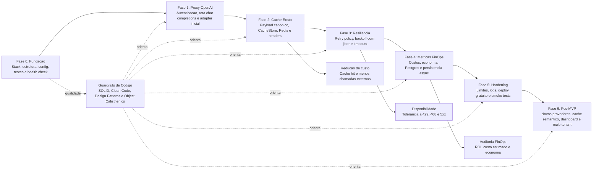

# Roadmap do Projeto FinOpsTokenSaver

Este roadmap organiza a evolucao do FinOpsTokenSaver em entregas pequenas, testaveis e alinhadas com uma arquitetura limpa. A ordem prioriza reduzir risco tecnico antes de adicionar funcionalidades mais avancadas.

---

## Visao Grafica

---

## Fase 0: Fundacao do Projeto

**Objetivo:** Preparar uma base executavel, testavel e simples de manter.

### Entregas
* Definir stack inicial do backend.
* Criar estrutura de pastas separando dominio, aplicacao, infraestrutura e API.
* Configurar lint, formatacao e testes automatizados.
* Criar configuracao por variaveis de ambiente.
* Implementar `GET /health`.

### Criterios de Pronto
* Aplicacao sobe localmente.
* Testes rodam com um unico comando.
* Configuracoes obrigatorias falham rapido com mensagem clara.
* Nenhuma regra de negocio depende diretamente do framework HTTP.

---

## Fase 1: Proxy Compativel com OpenAI

**Objetivo:** Receber uma chamada no formato OpenAI e encaminhar ao provedor real.

### Entregas
* Criar rota `POST /v1/chat/completions`.
* Validar API key interna do gateway.
* Implementar adaptador inicial para OpenAI.
* Preservar formato de resposta do provedor.
* Padronizar erros compativeis com clientes OpenAI.

### Criterios de Pronto
* SDK oficial configurado com `base_url` do gateway consegue executar uma chamada.
* Credenciais reais do provedor nao aparecem em logs ou respostas.
* Requisicoes nao autenticadas retornam `401` sem chamar o provedor.

---

## Fase 2: Cache Exato com Redis

**Objetivo:** Reduzir chamadas repetidas ao provedor usando cache deterministico.

### Entregas
* Criar canonicalizacao de payload.
* Gerar `CacheKey` deterministica.
* Implementar contrato `CacheStore`.
* Implementar adaptador Redis.
* Adicionar politica de cacheabilidade.
* Retornar headers `X-Cache-Status` e `X-Gateway-Latency-Ms`.

### Criterios de Pronto
* Duas requisicoes identicas geram cache hit na segunda chamada.
* Payloads com ordem JSON diferente geram a mesma chave.
* Erros e streaming nao sao cacheados.
* Testes unitarios cobrem canonicalizacao e politica de cache.

---

## Fase 3: Resiliencia de Provedor

**Objetivo:** Tolerar falhas transientes sem esconder erros reais do cliente.

### Entregas
* Criar contrato `RetryPolicy`.
* Implementar exponential backoff com jitter.
* Aplicar retry somente a erros elegiveis.
* Configurar timeout por provedor.
* Expor `X-Retry-Count`.

### Criterios de Pronto
* Falhas 429, 408 e 5xx recebem ate 3 tentativas.
* Falhas 4xx de cliente nao sao retentadas.
* Timeout total respeita limite configurado.
* Testes simulam sucesso apos retry e falha final.

---

## Fase 4: Metricas FinOps Assincronas

**Objetivo:** Registrar custo, economia e latencia sem afetar a resposta principal.

### Entregas
* Criar entidade `FinOpsMetric`.
* Criar catalogo de precos versionado.
* Calcular custo estimado por modelo.
* Implementar repositorio Postgres.
* Criar fila ou tarefa de background para persistencia.
* Adicionar migracao SQL inicial.

### Criterios de Pronto
* Falha no Postgres nao derruba a requisicao do cliente.
* Cache hit registra economia estimada.
* Cache miss registra custo estimado.
* Metricas possuem `request_id` para correlacao.

---

## Fase 5: Hardening para Deploy Gratuito

**Objetivo:** Ajustar consumo, logs e operacao para Azure F1, Redis free tier e Neon.

### Entregas
* Revisar uso de memoria em repouso.
* Definir limites de payload.
* Adicionar logs estruturados sem prompt completo.
* Criar documentacao de variaveis de ambiente.
* Criar guia de deploy.
* Adicionar smoke tests locais.

### Criterios de Pronto
* Aplicacao inicia com consumo de memoria coerente com Azure F1.
* Logs nao expõem segredos nem prompts por padrao.
* Deploy possui checklist operacional.
* Smoke test cobre health, autenticacao, cache miss e cache hit.

---

## Fase 6: Evolucao Pos-MVP

**Objetivo:** Expandir o produto sem comprometer a simplicidade do nucleo.

### Possiveis Entregas
* Suporte a Anthropic e Gemini via novos adapters.
* Cache semantico com embeddings.
* Dashboard de metricas.
* Rate limiting por chave de cliente.
* Multi-tenant.
* Streaming SSE com politica propria de cache bypass.
* Fallback entre provedores por estrategia configuravel.

### Guardrails
* Toda expansao deve entrar por abstracoes existentes.
* Novos provedores nao devem alterar casos de uso centrais.
* Funcionalidades com alto consumo devem ser opcionais e desligadas por padrao.
